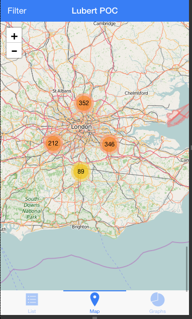

# Hybrid application using Ionic

## Technologies
- GulpJS as task runner
- npm and bower as package managers
- Stylus as html preprocessor
- Jade as html preprocessor
- Angular JS as main app framework
- Ionic JS as a wrapper to create compatible mobile versions
- Cordova JS as bridge between mobile devices and JS
- Leaflet JS as Maps Javascript framework
- Open Street Maps as a map tiles provider
- D3 as tool to generate interactive data graphics

## Global dependencies
In order to execute the app locally you need to have installed
- npm
- bower
- gulp
- ionic *
- ios emulator *

* Just in case you want to run the app on an emulator

## Usage
To run the app on your computer you need to follow these steps (on an unix terminal):
- Install global dependencies
- Clone the repo `$ git clone git@github.com:trepafi/ionic-app-structure.git lubertapp`
- Install dependencies `$ npm install && bower install`
- Run the server `$ gulp serve`
- Voilá :beer:, you can see the app on a browser at `http://localhost:3000`

For production
- Build the app running `$ gulp build --env=production`
- Running on an emulator `$ ionic build && ionic emulate ios`

## Build process
The app has a build process that prepares the dev and production environments.

**DEV**

For the `dev` environment the task runners does:
- Runs the `jade` and `stylus` preprocessors for creating the `htmls` and `css` files respectively
- Combines all the `html` files into a single `js` file generating the templates for angular
- Injects every required file into the `index.html` file
- Executes a server at [the port 3000 on localhost](http://localhost:3000)

**PROD**

Rather than the tasks executed for the `dev` environment, the task runner, for the `prod` environment does:
- Copies all the required files to the `www` folder necessary to execute an ionic application
- Minifies all the files
- Creates a version for the style and javascript files

**Ionic**
Once the production process has been completed we could test the app for mobile devices
The current status allows the app to run on `ios` devices, so you can execute `ionic emulate ios` to see the app in an emulator

## App features
The app has three tabs to display in different ways the data provided in the `artists.json` file

**List**
- Shows the data as a list
- The first 10 records are shown at the beginning
- Includes an infinite scroll which makes the list as short as the user needs
- The list is updated after filtering

**Map**
- Shows the data on a Open Street Map
- The results are clustered to allow a better visualization  
- Clicking on every cluster splits the same and fits the map on the previously grouped points
- The map is updated after filtering

**Graphs**
- Shows a pie graph grouping the results by age. The age is shown by groups of ten years
- Clicking on the bullets adds/removes pie portions
- The graph is updated after filtering

**Filtering**
- Shows a modal form to enable/disable filters

## Know issues :weary:
- [ ] Performance issue because the app is handling a big array. That's is a known issue when using angular (problem handling big amount of data) and there are some workarounds could be added to improve the performance
- [ ] Sometimes the graphs is not shown after browsing among the tabs
- [ ] Issue when executing `ionic build` to create the package for emulators

## TODO list :sunglasses:
- [ ] Add fancy sliders to select the min and max ages and rates on filters form

## Screenshots

**List**

**Map**

**Graphs**

**Filters**

